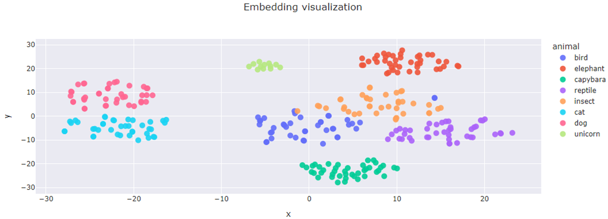
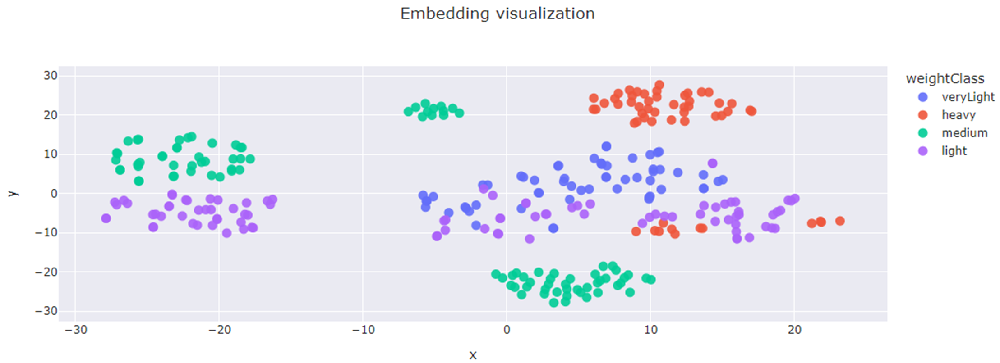
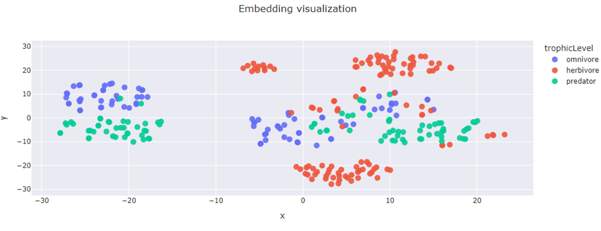

# Animal Fact Classifier — Text Embeddings + Neural Network

A machine learning project that uses OpenAI text embeddings and a neural network to classify animal-related text into multiple categories simultaneously. Given a sentence or description about an animal, the model predicts:

- The **animal** being described
- The **weight class** (e.g., veryLight, medium, heavy)
- The **trophic level** (e.g., herbivore, carnivore, omnivore)

---

## Project Structure
├── classification_setup.ipynb       # Main notebook — embedding, visualization & training   
├── open_ai_embedder.py              # OpenAI embedding wrapper with batching   
├── visualizer.py                    # Plotly scatter visualizer (2D/3D)   
├── animal_fact_model_trainer.py     # Keras model trainer   
├── labeld_animal_facts.json         # Labeled dataset of animal facts   
├── labeled_animal_facts_with_embeddings.json  # Cached embeddings   
├── .env.example                     # Environment variable template   
└── animal_model_*.keras             # Saved trained models (generated)   

---

## How It Works

### 1. Text Embeddings
Animal fact texts are embedded using OpenAI's `text-embedding-3-small` model, producing a **1536-dimensional vector** for each text sample. These vectors capture the semantic meaning of each sentence.

### 2. Dimensionality Reduction and Visualization
The high-dimensional embeddings are reduced to **2D using t-SNE** and plotted with Plotly. This lets us visually inspect whether embeddings naturally cluster by animal, weight class, or trophic level.




### 3. Neural Network Classifier
A feed-forward neural network is trained separately for each target label (`animal`, `weightClass`, `trophicLevel`).

**Architecture:**
Input (1536) -> Dense(2048, ReLU) -> BN -> Dropout(0.3)
-> Dense(1024, ReLU) -> BN -> Dropout(0.3)
-> Dense(512,  ReLU) -> BN -> Dropout(0.3)
-> Dense(num_classes, Softmax)
- Optimizer: `Adam`
- Loss: `Sparse Categorical Crossentropy`
- Early stopping with `val_loss` monitoring

### 4. Inference / Classification
Once trained, any free-text input can be classified across all three categories at once:

```python
classify_text("a cat is a small predatory mammal", n_predictions=1)
(
│   'a cat is a small predatory mammal',
│   {
│   │   'animal': [('cat', 0.3683663010597229)],
│   │   'weightClass': [('light', 0.45962703227996826)],
│   │   'trophicLevel': [('predator', 0.9657509326934814)]
│   }
)
```
## Setup

### 1. Clone the repo
```bash
git clone <your-repo-url>
cd <your-repo-name>
```

### 2. Set up a virtual environment 

```bash
python -m venv venv

# then
source venv/bin/activate

#or windows
venv\Scripts\activate
```

### 3. Install dependencies
```
pip install -r requirements.txt
```

### 4. Configure your API key (optional)
```
cp .env.example .env
```
```
OPENAI_API_KEY=your_api_key_here
```

### 5. Run the notebook
Open and run classification_setup.ipynb cell by cell.
> Note: Embeddings are cached in labeled_animal_facts_with_embeddings.json. Set should_recreate_embeddings=True to regenerate them and incur API costs.
